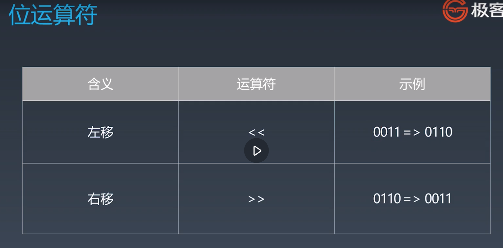
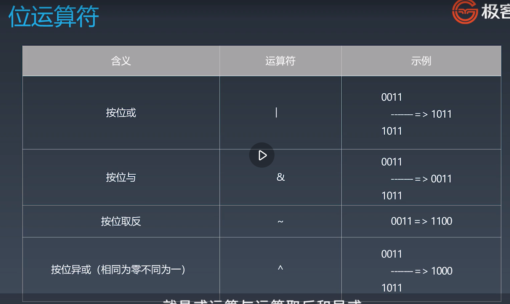
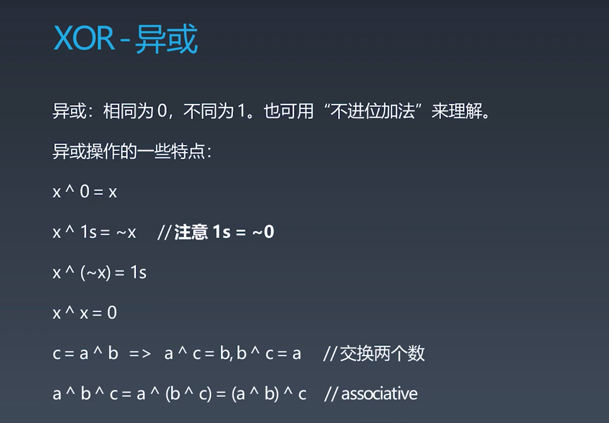
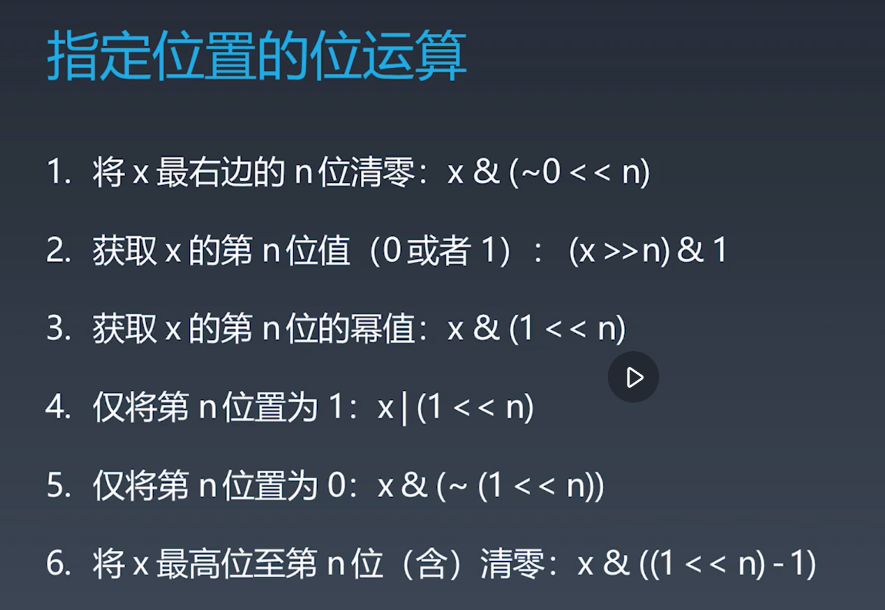
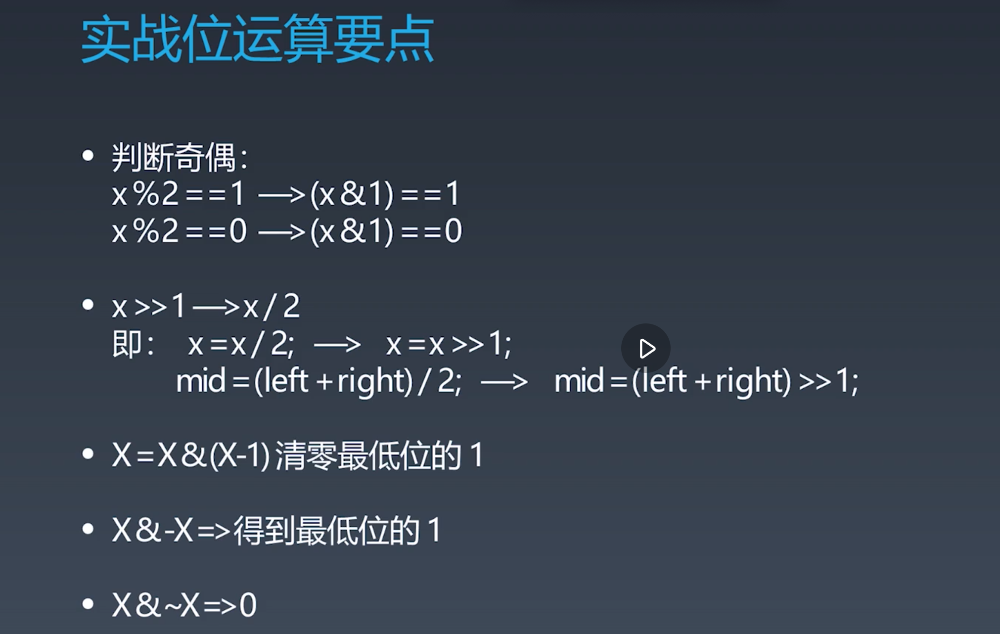

# 学习笔记

## 简单题目

* [位 1 的个数（Facebook、苹果在半年内面试中考过）](src/L_191_位1的个数.java)
* [2 的幂（谷歌、亚马逊、苹果在半年内面试中考过）](src/L_231_2的幂.java)
* [颠倒二进制位（苹果在半年内面试中考过）](src/L_190_颠倒二进制位.java)

## 中等题目

* [实现 Trie (前缀树) （亚马逊、微软、谷歌在半年内面试中考过）](src/Trie.java)
* [括号生成（亚马逊、Facebook、字节跳动在半年内面试中考过）](src/L_22_括号生成.java)
* [比特位计数（字节跳动、Facebook、MathWorks 在半年内面试中考过）](src/L_338_比特位计数.java)

## AVL树

* 平衡因子的由来是因为查询的时间复杂度基于树的深度，平衡因子=右子树深度-左子树深度
* 当平衡因子不在-1,0,1区间时，需要旋转树使其左右平衡
* 旋转操作有
    1. 左旋
    2. 右旋
    3. 左右旋
    4. 右左旋

* 缺点是需要额外存储信息，且调整次数频繁

## 红黑树

红黑树是一种近似平衡的二叉搜索树，它能够确保任何一个节点的左右子树的高度差小于二倍，具体来说满足以下条件：

* 每个节点要么是红色要么是黑色
* 根节点是黑色
* 每个叶节点（NIL节点，空节点）是黑色
* 不能有相邻的两个红色节点
* 从任意节点到其每个叶子的所有路径都包含相同数目的黑色节点

## 位运算

### 运算符

### 位运算实战

